# Multimodal Gameplay Video Understanding with Vision-Language Models

A research framework for multimodal video understanding and question-answering on gameplay footage, combining state-of-the-art vision encoders, audio processing, and large language models with trained projection adapters.


## Trained Weights

Download the trained adapters from Hugging Face:
**https://huggingface.co/cjm249/gameplay-vision-llm-adapters**

## Abstract

This project implements a multimodal perception-reasoning pipeline for analyzing gameplay videos. The system integrates visual perception (SAM3, SigLIP), temporal understanding (VideoMAE), audio processing (Wav2Vec2, Whisper), and text extraction (OCR) with a vision-language model (Qwen3-VL-8B-Instruct) through learned projection layers. The architecture enables natural language question-answering about video content by projecting heterogeneous perceptual embeddings into a unified representation space compatible with the language model's hidden dimensions.

## Project Validation (Verified Capabilities)

The final deployment validates the project’s ability to perform **long-horizon reasoning** by combining vision, temporal, and textual facts across extended timelines.

-   **Multimodal Alignment Success:** The system successfully integrated heterogeneous encoder features (SigLIP: 1152-dim, VideoMAE: 768-dim, Wav2Vec2: 1024-dim) into the Qwen LLM's **4096-dimension** latent space using the trained ProjectorBank.
-   **Causal Reasoning Verified:** LoRA fine-tuning successfully enabled the model to perform **structured strategic analysis** and answer complex 'why' questions, such as linking player actions to subsequent game state changes.
-   **Temporal Synthesis:** The system demonstrated the ability to synthesize detailed, chronological summaries of events spanning minutes of gameplay by retrieving context from the indexed timeline.

## Architecture

```mermaid
flowchart TB
    subgraph Input["📥 Input Layer"]
        VIDEO["🎬 Video File / YouTube URL"]
        FRAMES["🖼️ Frame Extraction (0.5 FPS)"]
        AUDIO["🔊 Audio Extraction (FFmpeg)"]
    end

    subgraph Perception["👁️ Perception Layer"]
        direction TB
        SAM3["SAM3 Concept Segmenter<br/>Entity Detection & Tracking"]
        SIGLIP["SigLIP 2 NaFlex<br/>Semantic Embeddings (1152-dim)"]
        OCR["PaddleOCR Pipeline<br/>UI Text, Subtitles, Numbers"]
    end

    subgraph AudioLayer["🎵 Audio Layer"]
        WHISPER["Whisper Base<br/>Speech Transcription"]
        WAV2VEC["Wav2Vec2-Large<br/>Audio Embeddings (1024-dim)"]
    end

    subgraph Temporal["⏱️ Temporal Layer"]
        VIDEOMAE["VideoMAE<br/>Temporal Context (768-dim)"]
    end

    subgraph Fusion["🔗 Fusion & Indexing Layer"]
        TIMELINE["Timeline Indexer<br/>Event Deduplication & Merging"]
        KNOWLEDGE["Knowledge Base Builder<br/>Entity, Temporal, Semantic Indexing"]
    end

    subgraph Reasoning["🧠 Reasoning Layer"]
        QWEN["Qwen3-VL-8B-Instruct<br/>Vision-Language Model"]
        PROJECTORS["Trained Projectors<br/>Embedding → LLM Space"]
        LORA["LoRA Adapter<br/>Task-Specific Fine-tuning"]
    end

    subgraph Output["📤 Output Layer"]
        RESPONSE["💬 Natural Language Response"]
        STREAM["⚡ Streaming Generation"]
    end

    VIDEO --> FRAMES
    VIDEO --> AUDIO
    
    FRAMES --> SAM3
    FRAMES --> SIGLIP
    FRAMES --> OCR
    FRAMES --> VIDEOMAE
    
    SAM3 --> SIGLIP
    SAM3 --> TIMELINE
    
    SIGLIP --> KNOWLEDGE
    OCR --> TIMELINE
    
    AUDIO --> WHISPER
    AUDIO --> WAV2VEC
    
    WHISPER --> TIMELINE
    WAV2VEC --> KNOWLEDGE
    VIDEOMAE --> KNOWLEDGE
    
    TIMELINE --> KNOWLEDGE
    
    KNOWLEDGE --> QWEN
    PROJECTORS --> QWEN
    LORA --> QWEN
    
    QWEN --> RESPONSE
    QWEN --> STREAM
```




## Key Features

### Autonomous Tool Calling
The system can autonomously search the web for game-related information when needed:
- Boss strategies and weaknesses
- Game lore and mechanics
- Item locations and effects

### Multi-Turn Conversation
- Maintains conversation history across questions
- Detects follow-up questions and uses context
- Supports commands like `/clear`, `/history`, `/save`, `/load`

### Confidence Scoring
- Each response includes a confidence score (0-100%)
- Based on available evidence and context

### Feature Caching
- Extracted features are cached to avoid reprocessing
- Subsequent runs load in ~30 seconds instead of ~15 minutes

---

### Perception Pipeline Components

| Encoder | Model | Output Dimension | Purpose |
|---------|-------|------------------|---------|
| SAM3 | facebook/sam3 | Segmentation masks | Entity detection and localization |
| SigLIP | google/siglip2-so400m-patch14-384 | 1152-dim | Semantic visual embeddings |
| VideoMAE | MCG-NJU/videomae-base | 768-dim | Temporal video understanding |
| Wav2Vec2 | facebook/wav2vec2-large | 1024-dim | Audio feature extraction |
| Whisper | openai/whisper-base | Text | Speech-to-text transcription |
| PaddleOCR | PaddlePaddle | Text | On-screen text extraction |

> **Note:** SAM3 requires `transformers>=5.0.0.dev0` (development version). Install with:
> ```bash
> pip install git+https://github.com/huggingface/transformers.git
> ```

### Projection Layer

Learned MLP projectors map heterogeneous encoder outputs to the LLM's hidden space (4096-dim):

```python
class MultiModalProjector(nn.Module):
    def __init__(self, input_dim, llm_dim=4096):
        self.proj = nn.Sequential(
            nn.Linear(input_dim, llm_dim),
            nn.GELU(),
            nn.Linear(llm_dim, llm_dim),
        )
```

### Fusion and Indexing

The project utilizes a **Hybrid Retrieval** system for context fetching, which is critical for long-video understanding:
-   **Time-Based Retrieval:** Used when the user provides an explicit timestamp (e.g., '@00:45'), retrieving events within a defined window.
-   **Semantic Retrieval:** For general queries ('what happened here?'), the system uses the **`all-MiniLM-L6-v2`** embedder to find the top $K$ most relevant events in the entire timeline index [A: 429, A: 437, A: 517].

### Reasoning Core

- **Base Model**: Qwen/Qwen3-VL-8B-Instruct
- **Attention**: Flash Attention 2
- **Fine-tuning**: LoRA adapters (r=16, alpha=32)
- **Precision**: bfloat16

## Installation

### Tested Environment

This project has been tested on:
- **RunPod Image**: `runpod/pytorch:2.8.0-py3.12-cuda12.8.0-ubuntu24.04`
- **Python**: 3.12+
- **CUDA**: 12.8+
- **GPU**: NVIDIA H200, A100 (40GB+ recommended)

### Quick Start (Recommended)

Use the automated setup script which handles all dependency ordering and known issues:

```bash
# Clone repository
git clone https://github.com/chasemetoyer/gameplay-vision-llm.git
cd gameplay-vision-llm

# Run the setup script (handles everything)
chmod +x setup_env.sh
./setup_env.sh

**MUST DOWNLOAD TRANSFORMERS 5.0.0X DEV VERSION FOR COMPATIBILITY WITH SAM3**

# Download trained weights from Hugging Face
python -c "from huggingface_hub import snapshot_download; snapshot_download('cjm249/gameplay-vision-llm-adapters', local_dir='outputs')"
```

The `setup_env.sh` script:
1. Installs PyTorch and build dependencies first
2. Installs Flash Attention from pre-built wheel
3. Installs core dependencies from `requirements-core.txt`
4. Installs PaddlePaddle GPU 3.2.0 from official Paddle wheel index
5. Restores PyTorch CUDA libraries (fixes conflicts)
6. Verifies all installations

### Run Inference

```bash
# With a local video (full processing with SAM detection)
python scripts/realtime_inference.py \
    --video "/path/to/your/gameplay.mp4" \
    --use-sam \
    --interactive

# With a YouTube URL
python scripts/realtime_inference.py \
    --video "https://www.youtube.com/watch?v=VIDEO_ID" \
    --use-sam \
    --interactive

# Without SAM3 (faster processing)
python scripts/realtime_inference.py \
    --video "/path/to/your/gameplay.mp4" \
    --interactive
```

### Manual Installation (Alternative)

If you prefer manual installation:

```bash
# 1. Install PyTorch first (required for Flash Attention)
pip install torch torchvision torchaudio accelerate

# 2. Install Flash Attention from pre-built wheel
pip install https://github.com/Dao-AILab/flash-attention/releases/download/v2.8.3/flash_attn-2.8.3+cu12torch2.8cxx11abiTRUE-cp312-cp312-linux_x86_64.whl

# 3. Install core dependencies
pip install -r requirements-core.txt

# 4. Install PaddleOCR with GPU (from official Paddle source)
python3 -m pip install paddlepaddle-gpu==3.2.0 -i https://www.paddlepaddle.org.cn/packages/stable/cu126/
pip install paddleocr
```

## Project Structure

```
gameplay-vision-llm/
├── README.md                      # This file
├── requirements.txt               # Full frozen dependencies
├── requirements-core.txt          # Core dependencies with min versions
├── pyproject.toml                 # Project metadata
│
├── src/                           # Source code
│   ├── agent_core/                # Core reasoning pipeline
│   │   └── qwen_reasoning_core.py # PerceptionReasoningLoop, ProjectorBank
│   ├── perception/                # Visual perception modules
│   │   ├── sam_concept_segmenter.py
│   │   ├── siglip_semantic_encoder.py
│   │   └── ocr_pipeline.py
│   ├── audio/                     # Audio processing
│   │   └── qwen_audio_processor.py
│   ├── temporal/                  # Temporal modeling
│   │   └── internvideo_hico_module.py
│   └── fusion_indexing/           # Timeline and retrieval
│       ├── timeline_indexer.py
│       └── knowledge_base_builder.py
│
├── scripts/                       # Executable scripts
│   ├── realtime_inference.py      # Main interactive inference
│   ├── extract_features.py        # Feature extraction pipeline
│   ├── train_projectors.py        # Projector training
│   ├── finetune_lora.py           # LoRA fine-tuning
│   └── demo_projector_inference.py
│
├── outputs/                       # Model outputs
│   ├── projector_weights.pt       # Trained projector weights
│   └── lora_adapter/              # LoRA adapter weights
│
├── data/                          # Data directory
│   ├── raw_videos/                # Input video files
│   ├── training/                  # Training data (Q&A pairs)
│   └── outputs/                   # Extracted features
│
├── docs/                          # Documentation
└── tests/                         # Unit tests
```

## Usage

### Real-Time Inference

Interactive question-answering on gameplay videos:

```bash
# Local video file with full processing
python scripts/realtime_inference.py \
    --video path/to/gameplay.mp4 \
    --use-sam \
    --interactive

# YouTube video (auto-download)
python scripts/realtime_inference.py \
    --video "https://youtube.com/watch?v=..." \
    --use-sam \
    --interactive

# Without SAM3 (faster, less accurate)
python scripts/realtime_inference.py \
    --video path/to/gameplay.mp4 \
    --interactive
```

### Interactive Commands

During interactive mode:
```
@<MM:SS> <question>  - Ask about specific timestamp
<question>           - Ask about whole video
/clear               - Clear conversation history
/history             - Show conversation summary
/save <path>         - Save conversation to file
/load <path>         - Load conversation from file
/game <name>         - Set game context (e.g., /game Elden Ring)
/search <query>      - Search web for game info
/wiki <topic>        - Search game wiki for topic
/boss <name>         - Look up boss strategy
quit                 - Exit
```

### Feature Extraction

Extract features for training or analysis:

```bash
python scripts/extract_features.py \
    --video path/to/video.mp4 \
    --output data/outputs \
    --use-sam \
    --fps 1.0
```

### Training

#### LoRA Fine-tuning

```bash
python scripts/finetune_lora.py \
    --data-dir data/training \
    --output-dir outputs/lora_adapter \
    --epochs 3 \
    --lr 2e-4
```

#### Projector Training

```bash
python scripts/train_projectors.py \
    --embeddings-dir data/outputs \
    --lora-path outputs/lora_adapter \
    --output-dir outputs \
    --epochs 5
```

## Training Methodology

### LoRA Adapter Training

The Qwen3-VL model is fine-tuned using Low-Rank Adaptation on gameplay Q&A pairs:
- **Target Modules**: q_proj, k_proj, v_proj, o_proj
- **Rank**: 16
- **Alpha**: 32
- **Learning Rate**: 2e-4

### Projector Training


The projection layers (Linear → GELU → Linear) are trained with a **Generative Alignment Objective** while keeping the LLM frozen. This objective utilizes **Mean Squared Error (MSE)** to optimize the projectors so that the norm (magnitude) of the projected embeddings approaches a target value (specifically, $\sqrt{\text{LLM\_hidden\_dim}}$), ensuring semantic compatibility with the Qwen LLM.

The LLM weights remain frozen; gradients flow only through projection layers.

## Memory Requirements

| Component | VRAM (bfloat16) |
|-----------|-----------------|
| Qwen3-VL-8B-Instruct | ~16 GB |
| SAM3 | ~4 GB |
| SigLIP | ~2 GB |
| VideoMAE | ~1 GB |
| Wav2Vec2/Whisper | ~1 GB |
| **Total** | **~24 GB** |

Recommended: NVIDIA A100 (40/80 GB) or H100

## Limitations

- **Real-time Processing Bottleneck:** The current latency for generating full perception features is limited by SAM3 segmentation.
    *   **SAM3 Detection Speed:** Processing averages **~2.2 seconds per frame** with TF32 optimization on A100 (improved from ~3.5s). BF16 is not currently supported for SAM3 inference.
    *   **SigLIP Embedding:** Uses BF16 for ~2x speedup on A100/H100 GPUs.
- Whisper transcription adds processing time for audio-heavy content
- OCR accuracy depends on video resolution and text clarity
- **Tool calling is model-dependent:** The 8B model may not always choose to search when it could. Larger models may be more consistent.
- **transformers version:** Requires `transformers>=5.0.0.dev0` for SAM3 support

## Future Work

### High Priority

- **Cascaded Processing and Efficiency**

- **Implement Trigger Detector:** Integrate the `TriggerDetector` mechanism to enable **selective analysis** (cascaded processing). This system must monitor perception outputs (e.g., SAM3 detecting a 'boss' or Qwen2-Audio detecting an 'explosion') and only activate the high-cost reasoning core (Qwen LLM) when a significant, high-confidence event is detected [A: 147, A: 163, A: 418].
- **Integrate Temporal Context Management (HiCo):** Activate the `TemporalContextManager` to use **Hierarchical Token Compression (HiCo)**, ensuring the LLM receives a continuous, rolling compressed context representing the last **5–10 minutes** of video via VideoMAE embeddings. This maintains long-range causal awareness while keeping token consumption low [A: 299, A: 405, A: 425].
- **Entity-Centric Knowledge Base:** Fully utilize the `KnowledgeBaseBuilder` to ingest structured facts (entity IDs, state changes, bounding boxes) extracted by SAM3, transforming raw detections into explicit causal linkages for the LLM to reason over [A: 142, A: 535].

- **SigLIP Inference Speed**
  - Batch encode multiple regions simultaneously
  - Use FP16/INT8 quantization for faster inference
  - Implement async encoding with prefetching
  - Explore SigLIP-Base for speed vs accuracy tradeoff

- **Multi-GPU Parallelization**
  - Pipeline parallelism: run SAM3, SigLIP, OCR, etc. on separate GPUs
  - Data parallelism: split frames across GPUs for same model
  - Async frame queues between pipeline stages
  - Target 3-5x speedup with 4 GPUs

- **Causal Link Extraction**
  - Explicit action→effect pairing from timeline events
  - Game state tracking (HP, mana, cooldowns)
  - Rule-based causal graph construction
  - Train causal reasoning module on gameplay data

- **Timeline Enrichment**
  - Integrate game-specific entity recognition
  - Add damage number parsing from OCR
  - Track character positions across frames
  - Build entity relationship graphs

### Medium Priority

- **Streaming Inference**
  - Real-time processing during video playback
  - Incremental timeline updates
  - Lower-latency response generation

- **Multi-Language Support**
  - Extend Whisper to detect and transcribe multiple languages
  - Add OCR support for non-Latin scripts (Japanese, Chinese, Korean)

- **Model Optimization**
  - Quantize projectors to INT8
  - Explore smaller LLM backbones (Qwen3-VL-4B)
  - ONNX export for faster inference
  - Investigate SAM3 BF16 compatibility for further speedup

- **SAM3 Batching**
  - Process multiple concepts per frame in a single forward pass
  - Implement CUDA streams for overlapping data transfer with compute
  - Increase SigLIP batch size from 16 to 32-64 regions

### Low Priority / Research

- **Game-Specific Adapters**
  - Train LoRA variants for specific game genres
  - Add game state parsers for popular titles

- **Interactive Training**
  - Human-in-the-loop feedback for improving responses
  - Active learning for edge cases

- **Evaluation Benchmarks**
  - Create gameplay video QA benchmark
  - Metrics for causal reasoning accuracy

## References

1. Kirillov, A., et al. "Segment Anything." ICCV 2023.
2. Zhai, X., et al. "SigLIP: Sigmoid Loss for Language Image Pre-Training." ICCV 2023.
3. Tong, Z., et al. "VideoMAE: Masked Autoencoders are Data-Efficient Learners for Self-Supervised Video Pre-Training." NeurIPS 2022.
4. Baevski, A., et al. "wav2vec 2.0: A Framework for Self-Supervised Learning of Speech Representations." NeurIPS 2020.
5. Radford, A., et al. "Robust Speech Recognition via Large-Scale Weak Supervision." arXiv 2022.
6. Qwen Team. "Qwen-VL: A Versatile Vision-Language Model." arXiv 2023.

## License

MIT License
