# Gameplay Vision LLM - Architecture Diagram

A multimodal video understanding system for gameplay analysis, combining vision, audio, and language models.

## High-Level Architecture

```mermaid
flowchart TB
    subgraph Input["📥 Input Layer"]
        VIDEO["🎬 Video File / YouTube URL"]
        FRAMES["🖼️ Frame Extraction (0.5 FPS)"]
        AUDIO["🔊 Audio Extraction (FFmpeg)"]
    end

    subgraph Perception["👁️ Perception Layer"]
        direction TB
        SAM3["SAM3 Concept Segmenter<br/>Entity Detection & Tracking"]
        SIGLIP["SigLIP 2 NaFlex<br/>Semantic Embeddings (1152-dim)"]
        OCR["PaddleOCR Pipeline<br/>UI Text, Subtitles, Numbers"]
    end

    subgraph Audio["🎵 Audio Layer"]
        WHISPER["Whisper Base<br/>Speech Transcription"]
        WAV2VEC["Wav2Vec2-Large<br/>Audio Embeddings (1024-dim)"]
    end

    subgraph Temporal["⏱️ Temporal Layer"]
        VIDEOMAE["VideoMAE<br/>Temporal Context (768-dim)"]
        INTERVIDEO["InterVideo HICO<br/>Action Recognition"]
    end

    subgraph Fusion["🔗 Fusion & Indexing Layer"]
        TIMELINE["Timeline Indexer<br/>Event Deduplication & Merging"]
        KNOWLEDGE["Knowledge Base Builder<br/>Entity, Temporal, Semantic Indexing"]
        CACHE["Feature Cache<br/>Avoid Reprocessing"]
    end

    subgraph Reasoning["🧠 Reasoning Layer"]
        QWEN["Qwen3-VL-8B-Instruct<br/>Vision-Language Model"]
        PROJECTORS["Trained Projectors<br/>Embedding → LLM Space"]
        LORA["LoRA Adapter<br/>Task-Specific Fine-tuning"]
        CONV["Conversation History<br/>Multi-turn Context"]
        SEARCH["Game Knowledge Search<br/>Web/Wiki Integration"]
    end

    subgraph Output["📤 Output Layer"]
        RESPONSE["💬 Natural Language Response"]
        STREAM["⚡ Streaming Generation"]
        INTERACTIVE["🎮 Interactive Q&A Mode"]
    end

    VIDEO --> FRAMES
    VIDEO --> AUDIO
    
    FRAMES --> SAM3
    FRAMES --> SIGLIP
    FRAMES --> OCR
    FRAMES --> VIDEOMAE
    
    SAM3 --> SIGLIP
    SAM3 --> TIMELINE
    
    SIGLIP --> KNOWLEDGE
    OCR --> TIMELINE
    
    AUDIO --> WHISPER
    AUDIO --> WAV2VEC
    
    WHISPER --> TIMELINE
    WAV2VEC --> KNOWLEDGE
    VIDEOMAE --> KNOWLEDGE
    
    TIMELINE --> KNOWLEDGE
    KNOWLEDGE --> CACHE
    
    KNOWLEDGE --> QWEN
    PROJECTORS --> QWEN
    LORA --> QWEN
    CONV --> QWEN
    SEARCH --> QWEN
    
    QWEN --> RESPONSE
    QWEN --> STREAM
    STREAM --> INTERACTIVE
```

---

## Component Details

### Perception Layer
| Component | Model | Output | Purpose |
|-----------|-------|--------|---------|
| [sam_concept_segmenter.py](file:///workspace/gameplay-vision-llm/src/perception/sam_concept_segmenter.py) | SAM 3 | TrackedEntity objects | Open-vocabulary entity detection & persistent tracking |
| [siglip_semantic_encoder.py](file:///workspace/gameplay-vision-llm/src/perception/siglip_semantic_encoder.py) | SigLIP 2 NaFlex | 1152-dim embeddings | Semantic region encoding from SAM masks |
| [ocr_pipeline.py](file:///workspace/gameplay-vision-llm/src/perception/ocr_pipeline.py) | PaddleOCR v3 | Text + BBox + Category | UI text, damage numbers, subtitles |

### Audio Layer
| Component | Model | Output | Purpose |
|-----------|-------|--------|---------|
| [qwen_audio_processor.py](file:///workspace/gameplay-vision-llm/src/audio/qwen_audio_processor.py) | Whisper + Wav2Vec2 | Transcription + 1024-dim embeddings | Speech recognition & audio understanding |

### Fusion Layer
| Component | Purpose |
|-----------|---------|
| [timeline_indexer.py](file:///workspace/gameplay-vision-llm/src/fusion_indexing/timeline_indexer.py) | Merge events by timestamp, deduplicate, priority ranking |
| [knowledge_base_builder.py](file:///workspace/gameplay-vision-llm/src/fusion_indexing/knowledge_base_builder.py) | Entity index, temporal index, semantic retrieval |

### Reasoning Layer
| Component | Purpose |
|-----------|---------|
| [qwen_reasoning_core.py](file:///workspace/gameplay-vision-llm/src/agent_core/qwen_reasoning_core.py) | Main LLM orchestration, perception-reasoning loop |
| [game_knowledge_search.py](file:///workspace/gameplay-vision-llm/src/agent_core/game_knowledge_search.py) | Web search, wiki lookup, boss strategies |

---

## Data Flow Diagram

---

## Module Dependency Graph

---

## Key Classes

| Class | File | Responsibility |
|-------|------|----------------|
| `PerceptionReasoningLoop` | qwen_reasoning_core.py | Main control loop, ties all modules together |
| `ReasoningCore` | qwen_reasoning_core.py | Qwen3-VL model wrapper, prompt building, generation |
| `ConversationHistory` | qwen_reasoning_core.py | Multi-turn dialogue management |
| `SAMConceptSegmenter` | sam_concept_segmenter.py | SAM3-based entity tracking with persistent IDs |
| `SigLIPSemanticEncoder` | siglip_semantic_encoder.py | Region-to-embedding encoding |
| `TimelineIndexer` | timeline_indexer.py | Event timeline with modality tagging |
| `KnowledgeBase` | knowledge_base_builder.py | Semantic retrieval over indexed content |
| `GameKnowledgeSearch` | game_knowledge_search.py | External game knowledge retrieval |
